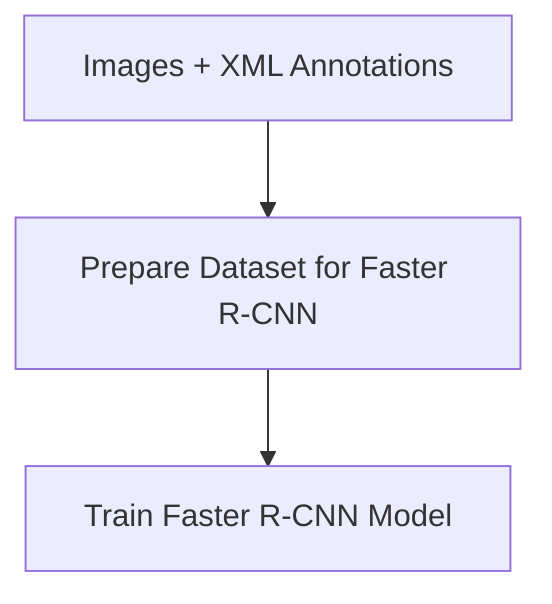
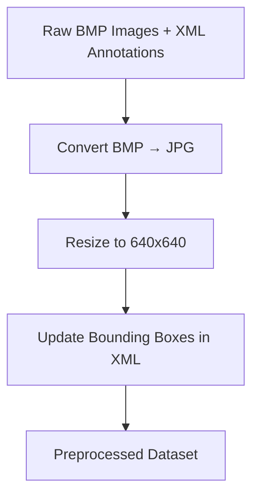
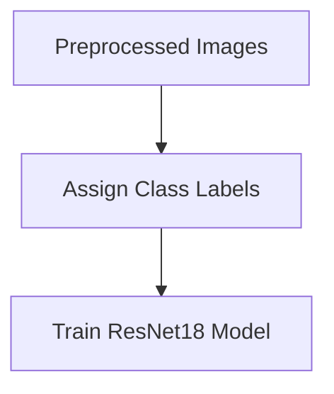
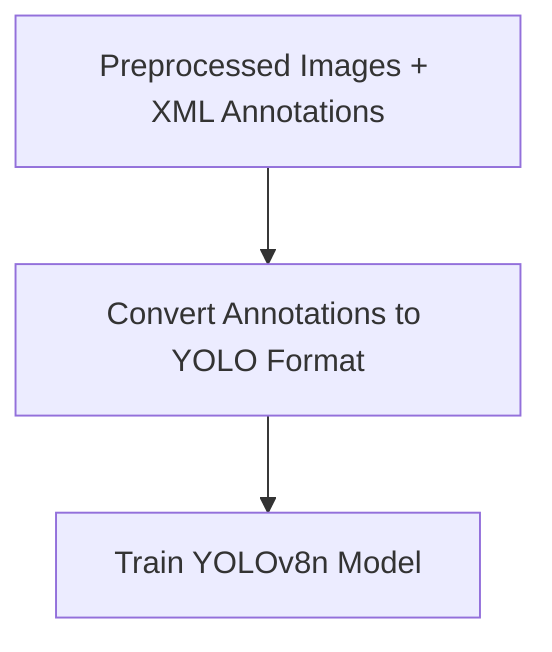

# 🧠 Project Overview

This project involves various tasks in Computer Vision including **image classification** and **object detection** using both traditional ML and deep learning models.

---

## 🗂️ Folder Structure & Workflow

### 1. `traditionalML/`

- ✅ Converts dataset (images + XML) into a **CSV format**
- ✅ Suitable for traditional ML models

```mermaid
flowchart TD
    A[Dataset (JPG + XML)] --> B[Parse Annotations]
    B --> C[Export CSV: image_name, bbox, class_label]
```

---

### 2. `objectDetectionDL_FASTER-RCNN/`

- ✅ Implements **Faster R-CNN** for object detection
- ✅ Trained on raw dataset (JPG + XML)



---

### 3. `data_preprocessing/`

- ✅ Converts `.bmp` images to `.jpg`
- ✅ Resizes images (e.g., to 640x640)
- ✅ Updates corresponding `.xml` annotations



---

### 4. `imageClassification/`

- ✅ Uses **ResNet18** for classifying images
- ✅ Likely assumes **one label per image**
- ✅ Trains on preprocessed dataset



---

### 5. `objectDetectionDL_YOLOv8n/`

- ✅ Implements **YOLOv8n** (lightweight YOLO model)
- ✅ Converts annotations to YOLO `.txt` format
- ✅ Trains object detector



---

## 📌 Notes

- All tasks depend on the **`data_preprocessing/`** step.
- `annotations/` are in **Pascal VOC XML** format, converted as needed for each model.
- `images/` are resized and standardized to ensure consistency across models.


# End Result 
