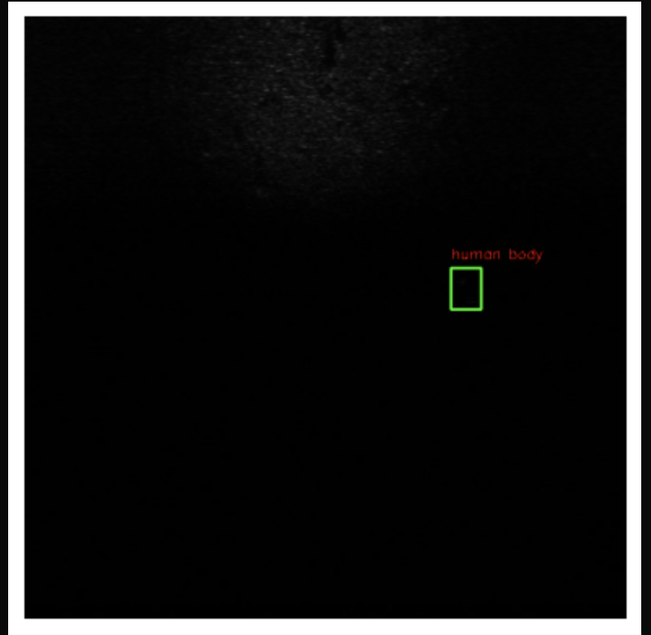

# 🎯 Underwater Object Detection in Sonar Imagery

<div align="center">
  
</div>

## 📊 Project Highlights

- 🚀 **Final Model**: YOLOv8n (You Only Look Once)
- 🎯 **Task**: Object Detection, Bounding boxes and Lables & Classification
- 📈 **Performance**: State-of-the-art detection capabilities
- 🔄 **Multiple Approaches**: From Traditional ML to Deep Learning
- 🛠️ **Comprehensive Pipeline**: Data preprocessing to end to end Project

## 🌟 Key Features

- **Multi-Model Comparison**: Traditional ML vs Deep Learning approaches
- **Automated Preprocessing**: Standardized image processing pipeline
- **Format Conversion**: Handles multiple annotation formats (XML, YOLO txt)
- **Performance Metrics**: Detailed evaluation and visualization
- **Modular Architecture**: Easy to extend and modify

## 📂 Project Structure


### 1. Traditional ML Approach (`traditionalML/`)


### 2. Data Preprocessing (`data_preprocessing/`)


- 🔄 Converts `.bmp` to `.jpg`
- 📐 Resizes images to 640x640
- 🎯 Updates bounding box annotations


### 3. Deep Learning Models

#### 3.1 Faster R-CNN (`objectDetectionDL_FASTER-RCNN/`)
- Two-stage detector architecture
- Region proposal network
- Feature pyramid network integration

#### 3.2 Image Classification (`imageClassificationDL/`)
- ResNet18 architecture
- Transfer learning approach
- Single-label classification

#### 3.3 YOLOv8n - Final Model 🏆 (`objectDetectionDL_YOLOv8n/`)


## 📈 Model Performance

### YOLOv8n Results
<div align="center">
  
</div>

### Performance Visualization
<div align="center">
  
</div>

## 🔍 Detection Examples

<div align="center">
  
</div>

## 🛠️ Setup & Usage

1. **Environment Setup**
   ```bash
   git clone <repository-url>
   cd <project-directory>
   ```

2. **Data Preprocessing**
   ```bash
   cd data_preprocessing
   python preprocess_images.py
   ```

3. **Running YOLOv8n**
   - Open `objectDetectionDL_YOLOv8n/uatd_YOLOv8n.ipynb`
   - Follow the notebook instructions for training and inference

## 📊 Results Analysis

The project demonstrates superior performance with YOLOv8n:
- High precision in object detection
- Real-time inference capabilities
- Robust performance across different scenarios

## 🔗 Dependencies

- Python 3.8+
- PyTorch
- Ultralytics YOLOv8
- OpenCV
- NumPy
- Pandas

## 📝 Notes

- Dataset is preprocessed using the pipeline in `data_preprocessing/`
- Annotations follow Pascal VOC XML format
- YOLOv8n provides the best balance of speed and accuracy

## 🌟 Future Improvements

- [ ] Model ensemble techniques
- [ ] Real-time video processing
- [ ] API deployment
- [ ] Mobile optimization

---


# Object Detection Web Application

This is a web application that uses YOLOv8 for object detection in images. The application consists of a React frontend and a Node.js backend that interfaces with a Python script for model inference.

## Prerequisites

- Node.js (v14 or higher)
- Python (v3.8 or higher)
- Your trained YOLOv8 model (`uatd_yolov8_m-pytorch-default-v1.tar.gz`)

## Setup

1. Install Node.js dependencies:
```bash
npm install
```

2. Install Python dependencies:
```bash
pip install -r requirements.txt
```

3. Place your trained model file (`uatd_yolov8_m-pytorch-default-v1.tar.gz`) in the root directory of the project.

## Running the Application

1. Start the backend server:
```bash
node server.js
```

2. In a new terminal, start the React development server:
```bash
npm start
```

3. Open your browser and navigate to `http://localhost:3000`

## Usage

1. Click the "Upload Image" button to select an image from your computer
2. Once an image is selected, you'll see a preview
3. Click the "Detect Objects" button to run the object detection
4. The results will be displayed below the image, showing detected objects and their confidence scores

## Project Structure

- `src/App.js` - React frontend application
- `server.js` - Node.js backend server
- `detect.py` - Python script for model inference
- `requirements.txt` - Python dependencies
- `package.json` - Node.js dependencies

## Notes

- The application expects your model file to be in the root directory
- The backend server runs on port 3001 by default
- The React development server runs on port 3000
- Uploaded images are temporarily stored in the `uploads` directory and automatically deleted after processing


<div align="center">
  Made with ❤️ Tensors
  Ahmad, Hema & China
</div>
